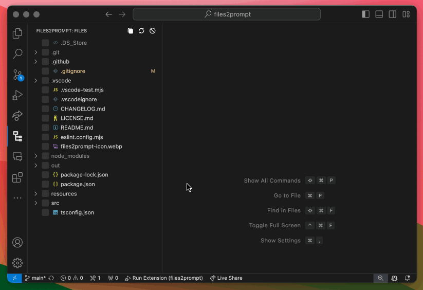

# Files2Prompt

[](https://github.com/Thomas-McKanna/Files2Prompt) [](https://github.com/Thomas-McKanna/Files2Prompt/actions/workflows/publish.yml)

Copy file contents in XML format for LLM prompts effortlessly.



## Features

- **Visual File Tree**: Browse and select files within your workspace using an intuitive tree view.
- **Selective Copying**: Easily choose which files to include in the copy operation with checkboxes.
- **XML Formatting**: Copies the content of selected files wrapped in XML `<file>` elements, ready for use in LLM prompts or other applications.
- **Custom System Message**: Optionally include a system message in your copied output, encapsulated within a `<systemMessage>` XML element.
- **Configurable Shortcuts**: Quickly refresh the file tree or copy files using customizable keyboard shortcuts.
- **Git Ignore Support**: Automatically ignores files and directories specified in your .gitignore.
- **Selection History**: Quickly switch between sets of previously selected files.
- **Paste XML Response**: If XML is pasted into the editor in the same format as the copied output, the files will automatically be updated or created in your workspace. This allows for rapid iteration. See [recommended workflow](#recommended-workflow) for more information.

## Installation

### Install from Marketplace:

1. Open VS Code.
2. Go to the Extensions view by clicking on the Extensions icon in the Activity Bar or pressing `Ctrl+Shift+X` (`Cmd+Shift+X` on macOS).
3. Search for "Files2Prompt".
4. Click Install.

### Install from VSIX:

1. Download the .vsix file from the releases page.
2. In VS Code, press `Ctrl+Shift+P` (`Cmd+Shift+P` on macOS) to open the Command Palette.
3. Type `Extensions: Install from VSIX...` and select the command.
4. Browse to the downloaded .vsix file and install.

## Usage

### Open Files2Prompt View:

- Click on the Files2Prompt icon in the Activity Bar to open the Files2Prompt view.

### Select Files:

- Browse through your workspace's file tree.
- Check the boxes next to the files you want to copy.

### Copy Files:

- Click the Copy Files button in the view's title bar or use the keyboard shortcut:
  - Windows/Linux: `Ctrl+C`
  - macOS: `Cmd+C`

### Refresh File Tree:

- To refresh the file tree view, click the Refresh button or use the keyboard shortcut:
  - Windows/Linux: `Ctrl+R`
  - macOS: `Cmd+R`

### Clear Selection:

- To clear all file selections, click the Clear Selection button or use the keyboard shortcut:
  - Windows/Linux: `Ctrl+Shift+C`
  - macOS: `Cmd+Shift+C`

### Paste XML Response:

- To update or create files in your workspace from LLM-outputted XML content, use the following keyboard shortcut while the extension UI is active:
  - Windows/Linux: `Ctrl+V`
  - macOS: `Cmd+V`

It is recommended that if you use this feature you have a custom system message (see section below) to ensure that the XML content is correctly formatted. Here is an example of such a system message:

```
Always provide full code listings. You only need to include files that have changed. I repeat, ALWAYS provide full code listings. Your output should be in XML format (in a code block) that mirrors the input format (that is, `<files>` element with a list of `<file>` in the interior).
```

### Include System Message:

1. Go to Settings (`Ctrl+,` or `Cmd+,` on macOS).
2. Navigate to Extensions > Files2Prompt.
3. Enter your custom system message in the System Message field.
4. When you copy files, this message will be included at the top of the XML output.

See recommended system message above.

## Configuration

### Customizing Keyboard Shortcuts

You can customize the keyboard shortcuts for refreshing and copying files:

1. Open Keyboard Shortcuts:
   - Press `Ctrl+K Ctrl+S` (`Cmd+K Cmd+S` on macOS).
2. Search for "Files2Prompt: Refresh" and "Files2Prompt: Copy Files".
3. Click on the desired command and press the new key combination you wish to assign.

### Setting a Custom System Message

1. Open Settings:
   - Press `Ctrl+,` (`Cmd+,` on macOS).
2. Navigate to Extensions > Files2Prompt.
3. Enter your desired system message in the System Message field.
4. If left empty, no system message will be included in the copied output.

## Example Output

```xml
<systemMessage>
<![CDATA[
This is a custom system message for LLM prompts.
]]>
</systemMessage>
<files>
  <file name="src/extension.ts">
    <![CDATA[
    // File content here
    ]]>
  </file>
  <file name="README.md">
    <![CDATA[
    # Readme content here
    ]]>
  </file>
</files>
```

## Recommended Workflow

The Files2Prompt extension allows for a rapid iterative workflow when working with an LLM. It is first recommended that you set the system message setting to that described [above](#include-system-message). This will ensure that the XML content is correctly formatted when pasted back into the editor.

Next, create a file called `prompt` in the root of your repository. You will want to add this to `.gitignore`. This file acts as a scratchpad for you latest prompt.

Optionally, create a directory called `docs` (also in `.gitignore`) where you can paste documentation into files for any technologies or code that is related to your project.

Then, a single iteration of the workflow might look like this:

1. Alter the `prompt` file with you desired next state.
2. Open the Files2Prompt view and select `prompt` and any other files that are relevant to your prompt. Also select any relevant documentation files from the `docs` directory.
3. Copy your XML prompt with the keyboard shortcut or button.
4. Paste the content into the LLM and submit.
5. Copy the LLM contents, which should be in XML format if you followed the system message instructions.
6. With the Files2Prompt view open, paste the LLM content with the keyboard shortcut or press the "play" icon in the UI. This will update the file contents or make brand new files.
7. Loop back to step 1.
